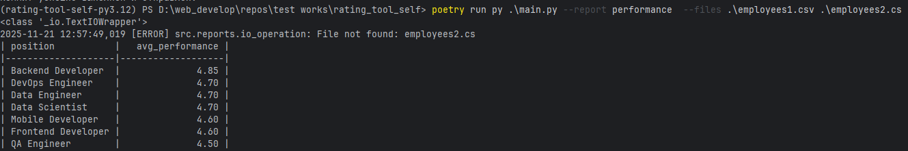

# Запуск скрипта
1. Установка зависимостей 
```poetry install```
2. Запуск скрипта
```poetry run py .\main.py --report performance  --files .\employees1.csv .\employees2.cs```
3. Запуск тестов 
```
poetry run pytest -v
```
# Регистрация отчетов - src/reports/register_reports.py
